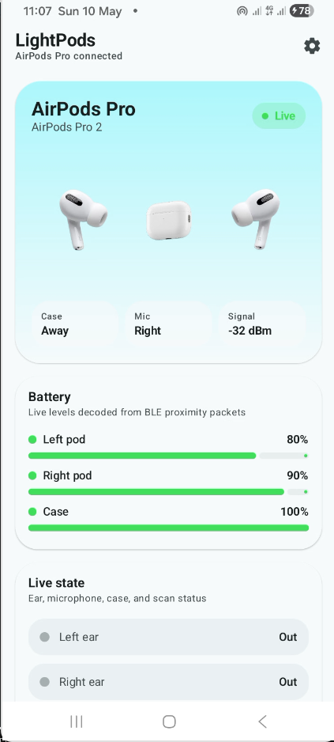
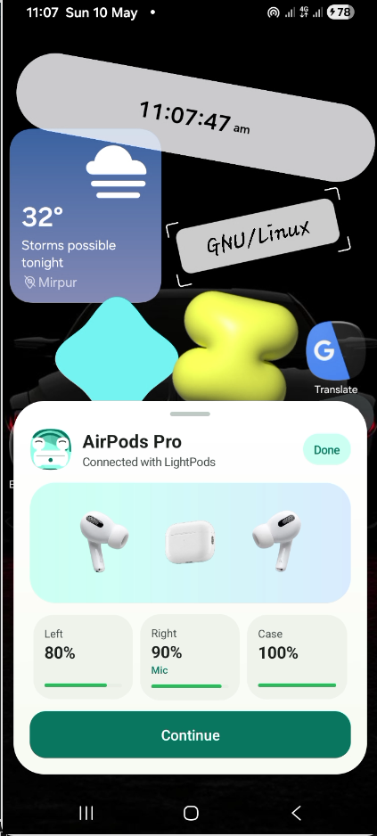
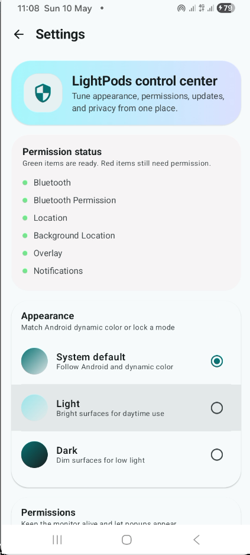
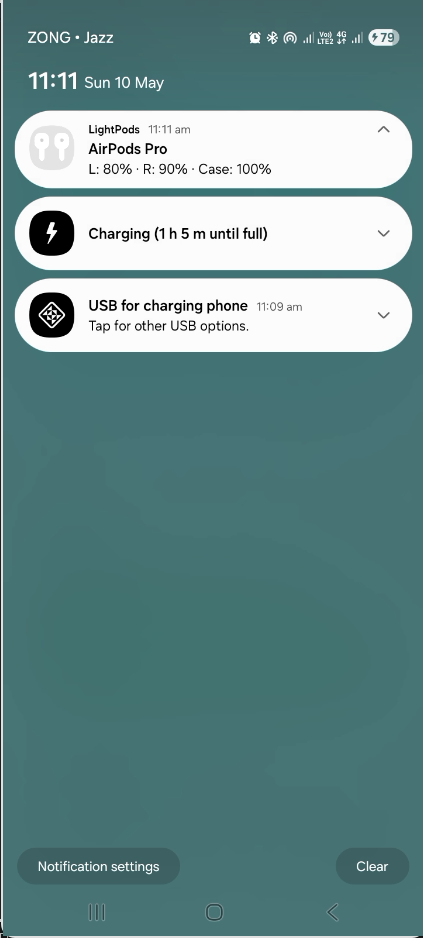

<p align="center">
  
</p>

<h1 align="center">LightPods</h1>

<p align="center">
  <strong>Material You companion app for AirPods Pro clones</strong><br>
  Real-time battery · Ear detection · Microphone tracking · BLE proximity scanning
</p>

<p align="center">
  <a href="https://github.com/uzairdeveloper223/lightpods/releases"></a>
  <a href="LICENSE"></a>
  <a href="https://lightpods.rf.gd/"></a>
</p>

---

## What is LightPods?

LightPods is an open-source Android app that provides a premium companion experience for Chinese AirPods Pro clones (Qualcomm QCC-based). It reverse-engineers Apple's proprietary BLE Continuity Protocol to extract **per-pod battery levels**, **microphone assignment**, **ear detection**, and **case lid state** — data that stock Android cannot display.

Built entirely with **Kotlin**, **Jetpack Compose**, and **Material Design 3** with dynamic color theming.

## Features

| Feature | How It Works |
|---|---|
| Per-Pod Battery | Decoded from BLE proximity pairing nibbles (data[4] upper/lower) |
| Microphone Detection | Status byte bit 5 XOR case-flip logic |
| Ear Detection | Status bits 1 & 3 with flip-aware mapping |
| Case Lid State | data[6] bit 3 with case-context gating |
| Charging Status | Flags nibble bits 0–2 (L/R/Case) |
| Connection Popup | System overlay (TYPE_APPLICATION_OVERLAY) with smart dismiss |
| Live Notification | Battery levels in the notification bar via foreground service |
| Material You | Dynamic color on Android 12+, dark/light/system toggle |
| BLE Scanning | Apple Company ID 0x004C, type 0x07 proximity pairing filter |
| HFP Fallback | AT+IPHONEACCEV vendor command parsing |

## Screenshots

<div align="center">
  
  
  
  
</div>

## Protocol Details

The app decodes **Apple Continuity Protocol** BLE advertisements:

```
Manufacturer Data (Company: 0x004C Apple)
├── [0]    Type: 0x07 (Proximity Pairing)
├── [1]    Length: 0x19 (25 bytes)
├── [2]    Prefix byte
├── [3-4]  Device Model (UShort)
├── [5]    Status byte
│   ├── bit 5: Primary pod (0=right, 1=left)
│   ├── bit 6: This pod is in case
│   ├── bit 4: One pod in case
│   ├── bit 2: Both pods in case
│   ├── bit 3: Ear detection A
│   └── bit 1: Ear detection B
├── [6]    Battery nibbles
│   ├── upper: Pod A (0-10 = 0-100%, 15 = N/A)
│   └── lower: Pod B (flip-aware via bit 5)
├── [7]    Flags + Case battery
│   ├── upper nibble: Charging flags (bit 0=L, 1=R, 2=Case)
│   └── lower nibble: Case battery (0-10, 15 = N/A)
├── [8]    Case lid state (bit 3: 0=open, 1=closed)
├── [9]    Color
└── [10]   Suffix
```

**HFP Fallback** for devices not broadcasting BLE:
```
AT+IPHONEACCEV=1,1,<value>  →  battery = (value + 1) × 10
```

## Architecture

```
app/src/main/java/uzair/lightpods/android/
├── MainActivity.kt                     # Navigation, permissions, edge-to-edge
├── bluetooth/
│   ├── PodState.kt                     # Data models (battery, gestures, state)
│   ├── BlePodsScanner.kt              # Apple proximity BLE parser
│   └── BluetoothPodsManager.kt        # HFP + BLE integration, state flow
├── service/
│   └── PodsMonitorService.kt          # Foreground service, live notification
├── settings/
│   └── AppSettings.kt                 # SharedPreferences (theme mode)
└── ui/
    ├── theme/                          # M3 color, typography, dynamic theming
    ├── components/
    │   ├── BatteryArc.kt              # Animated circular battery gauges
    │   └── ConnectionSheet.kt         # iOS-style bottom sheet popup
    ├── screens/
    │   ├── HomeScreen.kt              # Dashboard with animated state transitions
    │   ├── SettingsScreen.kt          # Theme toggle, permissions, about
    │   └── AboutScreen.kt            # App info + developer profile
    └── viewmodel/
        └── PodsViewModel.kt           # AndroidViewModel bridging BT → UI
```

## Build

```bash
git clone https://github.com/uzairdeveloper223/lightpods.git
cd lightpods
./gradlew :app:assembleDebug
# APK → app/build/outputs/apk/debug/app-debug.apk
```

**Requirements:** Android SDK 35, JDK 17+, Kotlin 2.0

## Hardware Tested

| Property | Value |
|---|---|
| Chip | Qualcomm QCC |
| MAC | `41:42:F1:B4:A2:E0` |
| Spoofs | AirPods Pro 2 |
| Charging | Lightning |
| Transport | Classic BT (BR/EDR) + BLE |
| Codecs | SBC, AAC, aptX, LDAC |

## Website

The project website is hosted at:

- **Landing page:** [lightpods.rf.gd](https://lightpods.rf.gd)
- **Privacy Policy:** [lightpods.rf.gd/privacy/index.html](https://lightpods.rf.gd/privacy/index.html)

Website source is in the [`website/`](website/) directory.

## Credits

- **CAPods** — Reference implementation for Apple Continuity Protocol parsing ([darken-eu/capod](https://github.com/darken-eu/capod))
- **Apple Continuity Protocol** — Reverse-engineered BLE proximity pairing spec
- **Material Design 3** — Google's design system for Android

## License

```
Copyright (C) 2026 Uzair Mughal

This program is free software: you can redistribute it and/or modify
it under the terms of the GNU General Public License as published by
the Free Software Foundation, either version 3 of the License, or
(at your option) any later version.
```

## Developer

**Uzair Mughal** — Full Stack Developer · Open Source Contributor (Linux Kernel) · Penetration Tester

- 🌐 [uzair.is-a.dev](https://uzair.is-a.dev)
- 💼 [LinkedIn](https://linkedin.com/in/uzairmughal001)
- 📧 [contact@uzair.is-a.dev](mailto:contact@uzair.is-a.dev)
